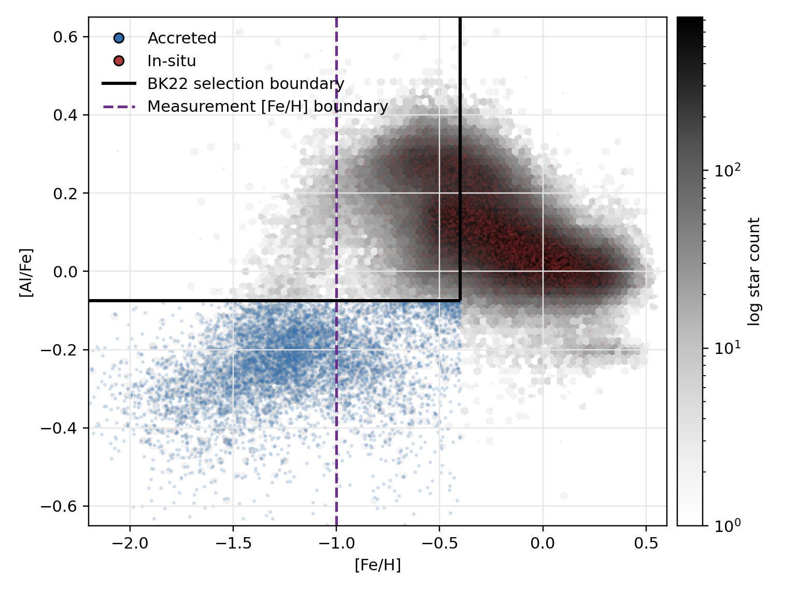
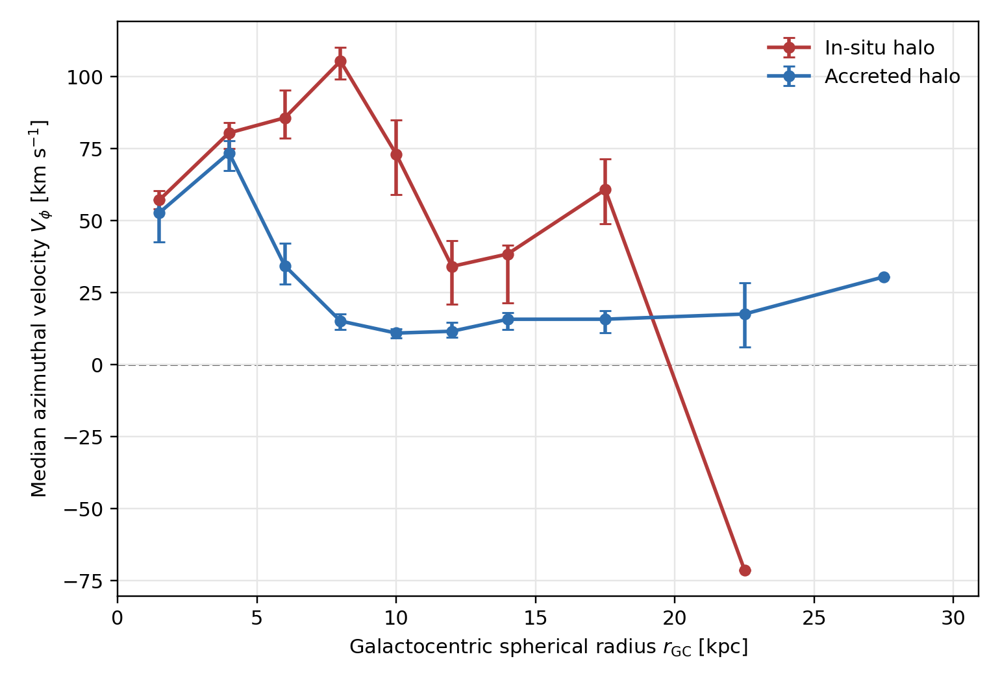
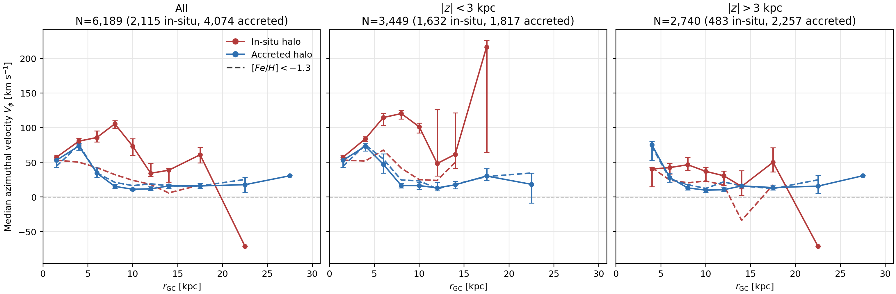
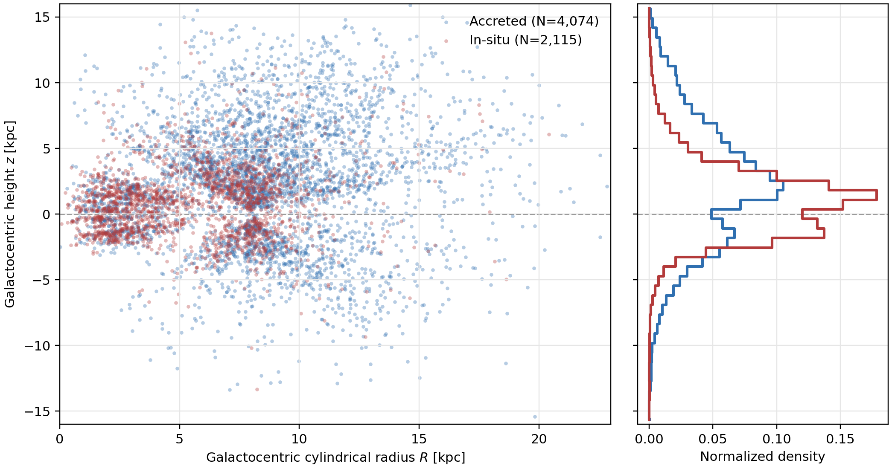

# APOGEE Halo Rotation

This repository measures the bulk azimuthal rotation of chemically selected in-situ and accreted Milky Way halo stars from APOGEE DR17 as a function of Galactocentric radius.

The chemical in-situ/accreted split follows Belokurov & Kravtsov (2022). The clean sample uses APOGEE/astroNN quality cuts and a public Gaia EDR3 globular-cluster member removal from Vasiliev & Baumgardt (2021), but does not apply an orbital-energy window.

## Data

The external catalogues are not committed to git. Download them into `data/external/` with:

```bash
python scripts/download_data.py
```

The script fetches:

| Dataset | Repository cache path | Public source |
|---|---|---|
| APOGEE DR17 allStarLite chemistry and flags | `data/external/allStarLite-dr17-synspec_rev1.fits` | `https://data.sdss.org/sas/dr17/apogee/spectro/aspcap/dr17/synspec_rev1/allStarLite-dr17-synspec_rev1.fits` |
| astroNN APOGEE DR17 distances and kinematics | `data/external/apogee_astroNN-DR17.fits` | `https://data.sdss.org/sas/dr17/apogee/vac/apogee-astronn/apogee_astroNN-DR17.fits` |
| Vasiliev & Baumgardt Gaia EDR3 globular-cluster members | `data/external/vasiliev_baumgardt_2021_clusters.zip` | `https://zenodo.org/records/4891252/files/clusters.zip?download=1` |

The Vasiliev & Baumgardt catalogue is the Zenodo dataset "Catalogue of stars in Milky Way globular clusters from Gaia EDR3", DOI `10.5281/zenodo.4891252`.

## Sample Selection

The script joins allStarLite and astroNN on `APOGEE_ID`, then applies the following clean-sample cuts:

- Finite required APOGEE abundances, uncertainties, astroNN distances, velocities, velocity uncertainties, and Galactocentric coordinates.
- Red giants: `LOGG < 3`.
- astroNN velocity uncertainties: `galvr_err`, `galvt_err`, `galvz_err < 50 km/s`.
- APOGEE abundance uncertainties: `C_FE_ERR`, `N_FE_ERR`, `O_FE_ERR`, `MG_FE_ERR`, `AL_FE_ERR`, `SI_FE_ERR`, `MN_FE_ERR`, `FE_H_ERR`, `NI_FE_ERR < 0.2 dex`.
- Remove APOGEE `ASPCAPFLAGS` containing `STAR_BAD`, `TEFF_BAD`, `LOGG_BAD`, `VERY_BRIGHT_NEIGHBOR`, `LOW_SNR`, `PERSIST_HIGH`, `PERSIST_JUMP_POS`, `PERSIST_JUMP_NEG`, or `SUSPECT_RV_COMBINATION`.
- Remove `ASPCAPFLAG` bit 23.
- Remove `EXTRATARG` duplicate bit `2**4` and telluric bit `2**2`.
- Remove `PROGRAMNAME` containing `magcloud`.
- Require non-zero Gaia EDR3 source id.
- Remove Vasiliev & Baumgardt GC candidates matched by Gaia source id with `memberprob > 0.8`.
- Require astroNN heliocentric distance `< 15 kpc`.
- No orbital-energy window is applied.

The in-situ/accreted chemical split is:

- In-situ: `[Fe/H] > -0.4`.
- At `[Fe/H] <= -0.4`, in-situ: `[Al/Fe] >= -0.075`.
- At `[Fe/H] <= -0.4`, accreted: `[Al/Fe] < -0.075`.

The default rotation measurement further restricts the sample to `[Fe/H] < -1.0`. The z-slice comparison plot overlays dashed curves for `[Fe/H] < -1.3`.

## Measurement

The reported rotation is the median astroNN Galactocentric azimuthal velocity `galvt`; positive velocity is prograde. Radius is spherical Galactocentric radius,

```text
r_GC = sqrt(galr^2 + galz^2)
```

where `galr` is the astroNN cylindrical Galactocentric radius. Bootstrap 16th/84th percentile intervals are shown for the median velocity.

Run the analysis with:

```bash
python scripts/measure_apogee_halo_rotation.py
```

By default, plots are written as PNG files only. PDF files are made only when the corresponding `--out-*-pdf` arguments are passed.

## Results

Current run summary:

| Quantity | Value |
|---|---:|
| Joined APOGEE-astroNN rows | 657,134 |
| Vasiliev & Baumgardt GC source ids with `memberprob > 0.8` | 1,008,359 |
| Clean sample after cuts | 242,120 |
| Measurement sample, `[Fe/H] < -1.0` | 6,189 |
| In-situ measurement stars | 2,115 |
| Accreted measurement stars | 4,074 |
| `\|z\| < 3 kpc` measurement stars | 3,449 |
| `\|z\| > 3 kpc` measurement stars | 2,740 |

Median rotation by spherical Galactocentric radius:

| Population | r range [kpc] | N | median Vphi [km/s] |
|---|---:|---:|---:|
| In-situ | 0-3 | 411 | 57.2 |
| In-situ | 3-5 | 437 | 80.5 |
| In-situ | 5-7 | 276 | 85.8 |
| In-situ | 7-9 | 620 | 105.5 |
| In-situ | 9-11 | 228 | 73.1 |
| In-situ | 11-13 | 73 | 34.2 |
| In-situ | 13-15 | 39 | 38.5 |
| In-situ | 15-20 | 30 | 60.8 |
| In-situ | 20-25 | 1 | -71.2 |
| Accreted | 0-3 | 263 | 52.8 |
| Accreted | 3-5 | 298 | 73.6 |
| Accreted | 5-7 | 314 | 34.4 |
| Accreted | 7-9 | 961 | 15.2 |
| Accreted | 9-11 | 772 | 11.0 |
| Accreted | 11-13 | 595 | 11.7 |
| Accreted | 13-15 | 407 | 15.8 |
| Accreted | 15-20 | 427 | 15.8 |
| Accreted | 20-25 | 36 | 17.6 |
| Accreted | 25-30 | 1 | 30.5 |

## Plots

Chemical selection:



Bulk rotation versus Galactocentric radius:



Rotation split by height from the Galactic plane. Solid curves use `[Fe/H] < -1.0`; dashed curves use `[Fe/H] < -1.3`.



Spatial distribution of the measured in-situ and accreted samples:



## References

- Belokurov, V. & Kravtsov, A. 2022, MNRAS, 514, 689.
- Vasiliev, E. & Baumgardt, H. 2021, MNRAS, 505, 5978.
